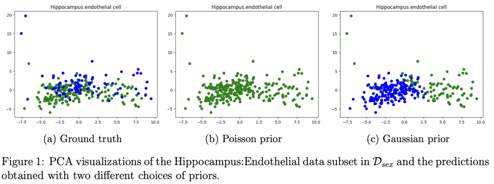
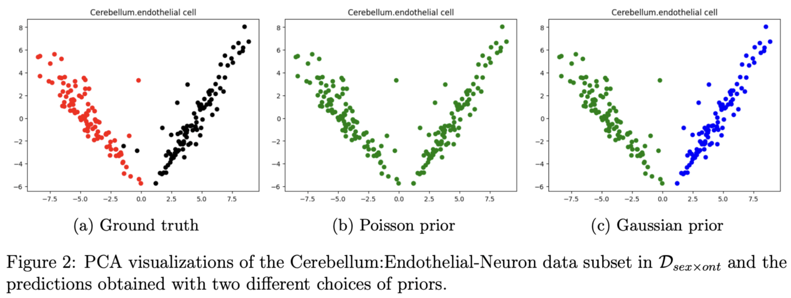

# EM Clustering with Single-Cell Transcriptomic Data

Expectation-Maximization (EM) -based clustering algorithm to identify groups defined by biological variates as clusters in single-cell transcriptomic data.

## Quick links

- [Project summary report [PDF]](./docs/project-report.pdf).
- [Data subsets [CSVs]](./data).

## Clustering results with Poisson and Gaussian Priors

- **Data with only sex as biological variate** - neither captured by Poisson nor Gaussian.   
  

- **Data with sex and cell ontology as biological variates** - cell ontology captured by Gaussian prior.   
  

## Key references

- Tabula Muris Consortium, et al. "Single-cell transcriptomics of 20 mouse organs creates a Tabula Muris." _Nature 562.7727 (2018): 367-372_.
- Moon, Todd K. "The expectation-maximization algorithm." _IEEE Signal processing magazine 13.6 (1996): 47-60_.
- Dempster, Arthur P., Nan M. Laird, and Donald B. Rubin. "Maximum likelihood from incomplete data via the EM algorithm." _Journal of the royal statistical society: series B (methodological) 39.1 (1977): 1-22_.
